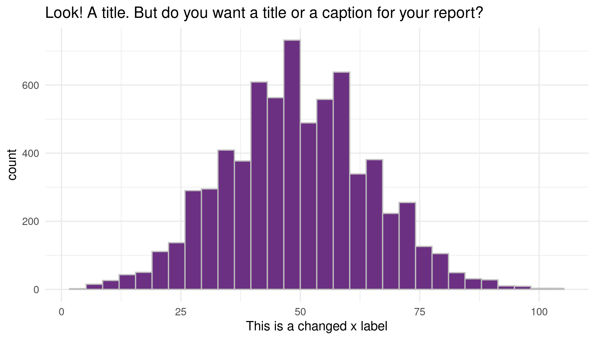

```{r, message = FALSE, echo=FALSE}
library(tidyverse)
# this should supress all code and messages
knitr::opts_chunk$set(include=FALSE)
```

# General comments (you can delete this section)

_You can delete this section, and if you want to check what it said, just open a template from the package again. You don't have to use this particular template, but you DO need to write you report in RMarkdown and include a cover page._

_The cover page must have:_

*	_A title and subtitle_
* _"Report prepared for Black Saber Software by" your company name_
*	_Date (assessment submission date is fine)_

_You can change the colour of this cover to any colour you would like by replacing 6C3082 in the YAML above (line 11) to another hex code. You could use this tool to help you:_ https://htmlcolorcodes.com/color-picker/

\newpage
# Executive summary

_Guidelines for the executive summary:_

* _No more than two pages_
* _Language is appropriate for a non-technical audience_
* _Bullet points are used where appropriate_
*	_A small number of key visualizations and/or tables are included_
*	_All three research questions are addressed_


\newpage
# Technical report
_This part of the report is much more comprehensive than the executive summary. The audience is statistics/data-minded people, but you should NOT include code or unformatted R output here._


## Introduction

_Provide a brief introduction to your report and outline what the report will cover. This section is valuable for setting scope and expectations. _

### Research questions
_Use bullet points to to describe the research questions you are going to address. Write in full sentences._

## Informative title for section addressing a research question

_For each research question, you will want to briefly describe any data manipulation, show some exploratory plots/summary tables, report on any methods you use (i.e. models you fit) and the conclusions you draw from these_

```{r}
# This chunk provides an example of some things you can do with RMarkdown to make your report creation process easier

# read in the data
black_saber_current_employees <- read_csv("data/black-saber-current-employees.csv")
final_hires_newgrad_2020 <- read_csv("data/final-hires-newgrad_2020.csv")

# create a visualisation
my_plot <- black_saber_current_employees %>% 
  ggplot(aes(x = productivity)) +
  geom_histogram(colour = "grey", fill = "#6C3082") +
  theme_minimal() +
  labs(title = "Look! A title. But do you want a title or a caption for your report?", x = "This is a changed x label")

# save your plot in your images folder, you can specify the height and width, too
# saving this means you can add the image to your exectuve summary without having to run or rerun the code, if you wish
ggsave("images/example.png", width = 7, height = 4)

# norice how the image is included with the  below
```



```{r, include = FALSE}
library(tidyverse)
library(lme4)

employees <- read_csv("data/black-saber-current-employees.csv")
phase1 <- read_csv("data/phase1-new-grad-applicants-2020.csv")
phase2 <- read_csv("data/phase2-new-grad-applicants-2020.csv")
phase3 <- read_csv("data/phase3-new-grad-applicants-2020.csv")
hires <- read_csv("data/final-hires-newgrad_2020.csv")
```

## Informative title for section addressing a research question
## Informative title for section addressing a research question
## Is bias present in the final round of the hiring process?
```{r}
phase2 <- phase2 %>%
  mutate(phase = 2)

phase3 <- phase3 %>%
  mutate(phase = 3)

hires <- hires %>%
  mutate(phase = 4)

applicants <- phase2 %>%
  full_join(phase3, by = c("applicant_id")) %>%
  full_join(hires, by = c("applicant_id")) %>%
  rowwise() %>%
  mutate(
    phase = max(phase, phase.x, phase.y, na.rm = TRUE),
    hired = ifelse(phase == 4, 1, 0)
  ) %>%
  select(-c(phase.x, phase.y))

phase3 <- phase3 %>%
  left_join(phase2, by = c("applicant_id")) %>%
  select(-c(phase.y)) %>%
  left_join(hires, by = c("applicant_id")) %>%
  rowwise() %>%
  mutate(
    phase = max(phase, phase.x, na.rm = TRUE),
    hired = ifelse(phase == 4, 1, 0),
    total_rating = interviewer_rating_1 + interviewer_rating_2
  ) %>%
  select(-c(phase.x))

hires <- hires %>%
  select(-c(phase)) %>%
  left_join(phase3, by = c("applicant_id"))
```

```{r}
# Tables

addmargins(table(applicants$team_applied_for, applicants$gender))
table(phase3$team_applied_for, phase3$gender)
table(hires$team_applied_for, hires$gender)

phase3 %>%
  group_by(gender) %>%
  summarise(
    "Rating 1" = mean(interviewer_rating_1),
    "Rating 2" = mean(interviewer_rating_2),
    "Leadership Presence" = mean(leadership_presence),
    "Speaking Skills" = mean(speaking_skills),
    "Writing Skills" = mean(writing_skills),
    "Technical Skills" = mean(technical_skills)
  )
```

```{r}
# Models

# Gender does not affect rating - interviewers seem to only look at skills/leadership (a biased measure)
rating_model <- lmer(total_rating ~ gender + leadership_presence + writing_skills + speaking_skills + technical_skills + (1|team_applied_for), data = phase3)
summary(rating_model)
confint(rating_model)

# Hired models

# Everyone who passed phase 1
glmer(hired ~ gpa + gender + extracurriculars + work_experience + technical_skills + writing_skills + speaking_skills + leadership_presence + (1|team_applied_for), family = binomial(link = "logit"), data = applicants)

# Only people who made it to phase 3
hired_simple <- glm(hired ~ gender + interviewer_rating_1 + interviewer_rating_2, family = binomial(link = "logit"), data = phase3)

hired_complex <- glm(hired ~ gender + interviewer_rating_1 + interviewer_rating_2 + leadership_presence + writing_skills + speaking_skills + technical_skills, family = binomial(link = "logit"), data = phase3)

lmtest::lrtest(hired_simple, hired_complex)
summary(hired_simple)
```


```{r}
# Checking if Phase_2 candidates selected by AI is bias or not
phase_1_selection <- phase1_new_grad_applicants_2020 %>%
  mutate(selection = ifelse(cover_letter == 1 & cv == 1 & gpa > 2 & extracurriculars > 0 & work_experience > 0,1,0)) #adding selecting criteria
model_1 <- lme4::glmer(selection ~ gender + (1|team_applied_for),family='binomial', data= phase_1_selection,nAGQ = 0) #checking if depended on gender
summary(model_1)
model_2 <- glm(selection ~ cv + cover_letter + gpa + extracurriculars + work_experience ,family='binomial', data= phase_1_selection)
summary(model_2) # checking if depended on variables other than gender
```
```{r} 
# testing model on phase_2

phase_2_selection <- left_join(phase2_new_grad_applicants_2020,phase_1_selection)
phase_2_selection$model_preb <- predict(model_1, phase_2_selection,type = "response")
phase_2_selection <- phase_2_selection  %>% mutate(model_pred = 1*(model_preb > .5) + 0, #checking for model_1
                                 visit_binary = 1*(selection == 1) + 0)
phase_2_selection <- phase_2_selection %>% mutate(accurate = 1*(model_pred == visit_binary))
sum(phase_2_selection$accurate)/nrow(phase_2_selection)
phase_2_selection$model_preb2 <- predict(model_2, phase_2_selection,type = "response")  # checking for model_2
phase_2_selection <- phase_2_selection  %>% mutate(model_pred2 = 1*(model_preb2 > .5) + 0, 
                                 visit_binary2 = 1*(selection == 1) + 0)
phase_2_selection <- phase_2_selection %>% mutate(accurate2 = 1*(model_pred2 == visit_binary2))
sum(phase_2_selection$accurate2)/nrow(phase_2_selection)
```
```{r}
# Chekcing if phase_3 candiadates selected by AI are based on bias or not 

model_speaking <- lmer(speaking_skills ~ gender + (1|team_applied_for),data = phase2_new_grad_applicants_2020 ) # if the speaking_skills depended on gender
summary(model_speaking)
confint(model_speaking)
model_writing <- lmer(writing_skills ~ gender + (1|team_applied_for),data = phase2_new_grad_applicants_2020) # if the writing_skills depended on gender
summary(model_writing)
model_leadership <- lmer(leadership_presence ~ gender + (1|team_applied_for),data = phase2_new_grad_applicants_2020) # if the leadership_presence depended on gender
summary(model_leadership)
confint(model_leadership)
model_technical <- lmer(technical_skills ~ gender + (1|team_applied_for),data = phase2_new_grad_applicants_2020)  # if the technical_skills depended on gender
summary(model_technical)
```
```{r}
set.seed(1)
selected <- replicate(1, n = 22) # adding a selected variable  
phase_3_selected <- cbind(phase3_new_grad_applicants_2020,selected)
phase_3_selected_join <- left_join(phase_3_selected,phase2_new_grad_applicants_2020)
phase_merge <- left_join(phase2_new_grad_applicants_2020,phase_3_selected)
phase_merge[is.na(phase_merge)] = 0
model_3 <- lme4::glmer(selected ~ gender + (1|team_applied_for),family='binomial', data= phase_merge,nAGQ = 0)
summary(model_3) #checking if selected depended on gender
model_4 <- glmer(selected ~ writing_skills + leadership_presence +(leadership_presence|gender) + speaking_skills  + (speaking_skills|gender) + extracurriculars + technical_skills + work_experience,family='binomial', data= phase_merge) #checking if selected depended on other variables
summary(model_4)
```

```{r} 
# testing models on pahse_3
phase_3_selected_join$model_preb <- predict(model_3, phase_3_selected_join,type = "response")
phase_3_selected_join <- phase_3_selected_join  %>% mutate(model_pred = 1*(model_preb > .5) + 0,
                                 visit_binary = 1*(selected == 1) + 0)
phase_3_selected_join <- phase_3_selected_join %>% mutate(accurate = 1*(model_pred == visit_binary))
sum(phase_3_selected_join$accurate)/nrow(phase_3_selected_join)
phase_3_selected_join$model_preb2 <- predict(model_4, phase_3_selected_join,type = "response")
phase_3_selected_join <- phase_3_selected_join  %>% mutate(model_pred2 = 1*(model_preb2 > .5) + 0,
                                 visit_binary2 = 1*(selected == 1) + 0)
phase_3_selected_join <- phase_3_selected_join %>% mutate(accurate2 = 1*(model_pred2 == visit_binary2))
sum(phase_3_selected_join$accurate2)/nrow(phase_3_selected_join)
```


## Discussion

_In this section you will summarize your findings across all the research questions and discuss the strengths and limitations of your work. It doesn't have to be long, but keep in mind that often people will just skim the intro and the discussion of a document like this, so make sure it is useful as a semi-standalone section (doesn't have to be completely standalone like the executive summary)._

### Strengths and limitations

\newpage
# Consultant information
## Consultant profiles

*Complete this section with a brief bio for each member of your group. If you are completing the project individually, you only need to complete one for yourself. In that case, change the title of this section to 'Consultant profile' instead. Examples below. This section is only marked for completeness, clarity and professionalism, not 'truth' so you can write it as if we're a few years in the future. Put your current degree in as completed and/or add your first choice grad school program, whatever you like. What skills related skills would you most like to highlight? What job title do you want?*

**Statsy McStatsstats**. Statsy is a senior consultant with Eminence Analytics. She specializes in data visualization. Statsy earned her Bachelor of Science, Specialist in Statistics Methods and Practice, from the University of Toronto in 2023.

**Datana Scatterplot**. Datana is a junior consultant with Eminence Analytics. They specialize in reproducible analysis and statistical communication. Datana earned their Bachelor of Science, Majoring in Computer Science and Statistics from the University of Toronto in 2024.

## Code of ethical conduct

_This section should be fairly short, no more than half a page. Assume a general audience, much like your executive summary._

* _Make at least three relevant statements about your company’s approach to ethical statistical consulting. These should be appropriately in line with professional conduct advice like the (Statistical Society of Canada Code of Conduct)[https://ssc.ca/sites/default/files/data/Members/public/Accreditation/ethics_e.pdf] or the (Ethical Guidelines for Statistical Practice from the American Statistical Society)[https://www.amstat.org/ASA/Your-Career/Ethical-Guidelines-for-Statistical-Practice.aspx]. For example, "the customer is always right" ISN’T the type of thing an ethical statistical consultant would include._
*	_Be very careful not to just copy and paste from these other documents! Put things in your own words._


__Final advice: KNIT EARLY AND OFTEN!__