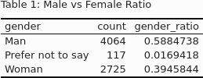
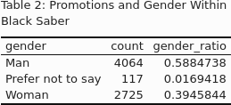
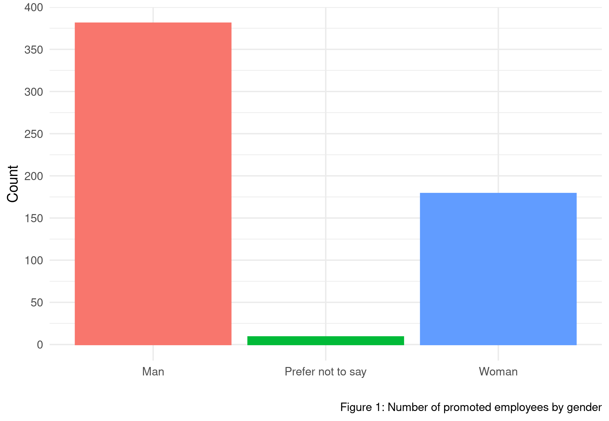
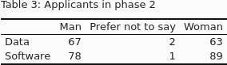
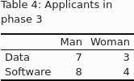
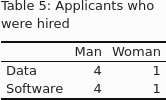

```{r, message = FALSE, echo=FALSE}
library(tidyverse)
# this should supress all code and messages
knitr::opts_chunk$set(include=FALSE)
```

\newpage
# Executive summary

According to the quarterly datasets provided by Black Saber software, RACS Consulting Limited was able to obtain both salary and role seniority data of current employees and use them to conduct research on the potential gender biases in the remuneration and promotion process in the Black Saber company.

In the study of salary and promotion processes, the results are summarised below:

- Table 1 shows that 58.84% of the entries in the employee data are from males and 39.46% of the entries are from female workers.
- According to table 2, out of all 6906 entries of quarterly employee data, promotions happened about 569 times, which translates to an 8.24% of promotion rate in the total employee data.
- After fitting our statistical model, we found that female workers have 30.44% lower odds to be promoted than male workers given the same level of productivity, leadership level and the same team/department they work in.
- On average, male workers have $1,763.21 higher salary than female workers.

On the other hand, RACS Consulting was also given the new grad hiring datasets and was able to investigate whether the AI software used for hiring and the interviewers at Black Saber were potentially gender biased in the hiring process.

- Although there were a roughly equal number of men and women candidates in phase 2, this ratio doubled to about twice the number of men as women in phase 3 and exactly 4 men and 1 woman hired in both teams.
- We made two models. In the model with gender, 1.09 lesser times women would be selected than men but this is not significant so we cannot use this. In the other model, the GPA and extracurriculars have 38222.094 and 125.46 times more chance of getting selected.
- In Phase 2,  we made four models and in each of them, we checked if the scoring of them is biased for any specific gender. 5.87 times lower women would get scored than men for speaking skills and similarly lesser odds for 2.36 times lower women would get scored than men for leadership presence.
- But in writing skills 82.43 times women would get a higher score than men. This shows AI is biased towards specific gender while scoring.
- We made two models, the first one with gender. It shows 2.38 lower times women would be selected than men but the value is not significant. The second model showed 1.09 times writing skills, 2.64 times leadership presence, 2.08 times for speaking skills and 1.08 times for technical skills are likely to be selected.
- The selection criteria are dependent on variables that are scored by AI but these scoring variables are biased for a specific gender. So, AI is biased but indirectly.
- In our fitted model for interviewer ratings, we found that gender is not a significant factor in determining the interviewer ratings, meaning that the interviewers of Black Saber are not gender biased.








\newpage
# Technical report

## Introduction

RACS Consulting Limited is helping Black Saber Software address concerns of potential bias in its hiring and remuneration processes. We will be examining the data provided by Gideon Blake of Black Saber Software through the use of statistical methods. More specifically, we will be data wrangling, building models, and performing statistical tests and inference to draw conclusions. This report will focus heavily on gender bias; we've determined that this is where bias is most likely to occur given its frequent being either a direct or an indirect source of bias in previous contexts.

### Research questions

There are a few research questions relating to Black Saber Software's employee and hiring pipeline which we will examine in depth:

- Whether or not gender bias occurs in the employee salaries.
- Whether or not gender bias occurs in employee promotions.
- Whether or not gender bias occurs in the hiring pipeline via the AI or the interviewer component.

```{r, include = FALSE}
library(tidyverse)
library(ggplot2)
library(lme4)
library(gamm4)
library(knitr)
library(kableExtra)
library(magick)

black_saber_current_employees <- read_csv("data/black-saber-current-employees.csv")
phase1 <- read_csv("data/phase1-new-grad-applicants-2020.csv")
phase2 <- read_csv("data/phase2-new-grad-applicants-2020.csv")
phase3 <- read_csv("data/phase3-new-grad-applicants-2020.csv")
hires <- read_csv("data/final-hires-newgrad_2020.csv")
```

## Does gender bias occur in the employee salaries?

### Dataset

```{r}
## Dataset ###################################################################
black_saber_current_employees <- black_saber_current_employees %>% 
  mutate(
    salary = as.numeric(gsub('[$,]', '', salary))
  )

# Relevel the roles in ascending order
black_saber_current_employees$role_seniority = fct_relevel(
    black_saber_current_employees$role_seniority,
    "Entry-level",
    "Junior I",
    "Junior II",
    "Senior I",
    "Senior II",
    "Senior III",
    "Manager",
    "Director",
    "Vice president"
  )

black_saber_current_employees$leadership_for_level = fct_relevel(
  black_saber_current_employees$leadership_for_level,
  "Appropriate for level",
  "Needs improvement",
  "Exceeds expectations"
)
```

In our research, we conducted two tests derived from the employee dataset. The first test was to check whether there exists a gender bias in the salary of current employees. For this particular test, we used the current employee's data collected from Black Saber Software without any further alterations. The model included 6,906 current employees. To study the gender bias in the salary, we considered gender, role seniority, leadership, and productivity as fixed variables, and team as a random variable.

### Methods

```{r}

#generalized linear model
model1 <- glm(salary ~ gender + role_seniority + leadership_for_level + productivity, data = black_saber_current_employees)

summary(model1)
confint(model1)

#linear mixed model 
model2 <- lmer(salary ~ gender + role_seniority + leadership_for_level + productivity + (1|team), data = black_saber_current_employees)

summary(model2)
confint(model2)

#likelihood ratio test between two models
lmtest::lrtest(model1, model2)

```

First, we used a generalized linear model on gender bias in salary with variables of role seniority, leadership, and productivity without the team variable. This model showed that the variable gender and role seniority are significant with extremely small p-value. Also, at 95% confidence interval, there was no evidence that leadership and productivity are significant to the salary, but gender and role seniority were. The second model used a linear mixed model adding team variable as random effect. The model showed that men earn $1,763.21 more on average than women for each quarter, and the average salary got higher as they were promoted to senior positions. By looking at the t-values, we figured that the gender and role seniority variable have large t-values indicating they are both significant. The confidence interval of this model seemed to have similar results with the first model.

At last, we used a likelihood ratio test to determine which model fitted the data better. Since there was strong evidence with p-value less than 0.01 against that generalized linear model explains the data as well, we determined that the linear mixed effect model with team variable as random effect explains the data better than the generalized linear model.


## Does gender bias occur in the employee promotions?

### Dataset

```{r}
## Dataset ###################################################################

# Each employee served different number of years at the company
employee_clean <- black_saber_current_employees %>% 
  group_by(employee_id) 

# Summarize promotion data for each employee
promotion_stat <- employee_clean %>% 
  group_by(employee_id ,role_seniority) %>% 
  summarise(count = n(), .groups = 'drop') %>% 
  group_by(employee_id) %>% 
  mutate(quarter_of_service= sum(count)) 


# Times of promotion 
n_promotion <- promotion_stat %>% 
  group_by(employee_id) %>% 
  count(role_seniority) %>% 
  summarise(n_promotion = n() -1 , .groups = 'drop') 

# Join promotion number and quarter_of_service together 
promotion_rate <- full_join(n_promotion, promotion_stat, by = "employee_id") %>% 
  mutate(rate = n_promotion/quarter_of_service) %>% 
  arrange(-rate)

# Promoted employees and their promotion rate by quarter
subset <- promotion_rate %>% 
  select(employee_id, rate) %>% 
  distinct()

# Define promotion rate and add to the employee dataset
fully_clean <- left_join(employee_clean, subset, by = "employee_id")
```

The second test we ran on the current employee dataset was to test whether promotion processes were biased in Black Saber Software. In this particular test, we defined a dummy variable called "promoted" that shows 0 when the person did not get promoted compared to the previous period, or 1, when the person's role-seniority changed compared to the previous period. The new variable would act as the response variable in our test and we would be able to check whether the historical promotion process was gender biased. Since the response is either 0 or 1, it is clear that the response follows a binomial distribution. Thus, it's suitable to model the data using logistic regression.

### Model

```{r}
## Model Construction #########################################################

# Define dummy variable and specify each quarter's promotion status
testing <- employee_clean %>% 
  group_by(employee_id) %>% 
  mutate(x = lag(role_seniority)) %>% 
  mutate(promoted = ifelse(role_seniority != x, 1, 0)) %>% 
  mutate(promoted = ifelse(is.na(promoted), 0, promoted)) %>% 
  mutate(team = as_factor(team)) %>% 
  mutate(leadership_for_level =fct_relevel(leadership_for_level))

testing %>% 
  group_by(promoted) %>% 
  summarise(count = n(), .groups = 'drop')

levels(testing$leadership_for_level)

# Data for promotion count link to each person's employee data
dat_new <- full_join(n_promotion, employee_clean, by = "employee_id") 

# Fit a Poisson model (Zero Inflated)
promotion_model_1 <- glm(promoted ~ productivity + gender , data = testing, family = binomial(link= "logit"))
summary(promotion_model_1)
confint(promotion_model_1)

# Add leadership for level
promotion_model_2 <- glm(promoted ~ productivity + gender + leadership_for_level, data = testing, family = binomial(link = "logit"))
summary(promotion_model_2)
confint(promotion_model_2)

# Add random intercept for teams 
promotion_model_3 <- gamm4(promoted ~ productivity + gender+ leadership_for_level+ s(team, bs = "re") , family = binomial(link = "logit"), data = testing)

# Model with only random effect
promotion_model_4 <- glmer(promoted ~ 1 + (1|team), family = binomial , data = testing)
summary(promotion_model_4)
confint(promotion_model_4)
```
```{r}
# Male vs female ratio
promotion_table_1 <- testing %>% 
  group_by(gender) %>% 
  summarise(count = n(), .groups = 'drop') %>% 
  mutate(gender_ratio = count/sum(count))

# Data exploration on the number of promotions happened within the company 
promotion_table_2 <- testing %>% 
  mutate(promoted = case_when(
    promoted == 1 ~ "promoted",
    promoted == 0 ~ "not promoted"
  )) %>% 
  group_by(promoted, gender) %>% 
  summarise(number_of_promotions = n(), .groups = 'drop') %>% 
  group_by(promoted) %>% 
  mutate(ratio = number_of_promotions / sum(number_of_promotions))

kable(promotion_table_1, "html", caption = "Table 1: Male vs Female Ratio") %>%
  kable_classic(full_width = F) %>%
  save_kable(file = "images/gender_table.png", density = 100)

kable(promotion_table_1, "html", caption = "Table 2: Promotions and Gender Within Black Saber") %>%
  kable_classic(full_width = F) %>%
  save_kable(file = "images/promotion_table.png", density = 100)

# Data exploration on promoted employees
testing %>% 
  mutate(promoted = case_when(
    promoted == 1 ~ "promoted",
    promoted == 0 ~ "not promoted"
  )) %>% 
  filter(promoted == "promoted") %>%
  ggplot(aes(x = gender, colour = gender, fill = gender)) + 
    geom_bar(position = "dodge") + 
    theme_minimal() +
    scale_y_continuous(breaks = seq(0, 400, 50)) +
    theme(legend.position = "none") +
    labs(x = "",
         y = "Count",
         caption = "Figure 1: Number of promoted employees by gender"
         ) +
  ggsave("images/figure1.png")
```

The first model we used in this section is a standard logistic regression with productivity, gender and leadership for level as independent variables. In this model, we observed that under 95% confidence interval, a female faces 37.26% lower odds to be promoted compared to a male worker with all qualifications being the same. Although this result has a high significance level, we noticed that there are different operating teams within the company and we suspect that each team may have a different standard for promoting employees within the group. Thus, in our second model, we decided to include these factors into our generalized linear mixed model and see if random effects of employees working in a different team have any influence on the promotion processes.

### Results

After fitting our model, we found that for productivity and leadership level being fixed, a female worker has 30.44% lower odds to be promoted compared to a male worker that has the same qualifications. With p-value being less than 5% level, it suggests that the results we got from this model is reliable and gender bias does exist within the promotion process at Black Saber Software.


## Is bias present in the final round of the hiring process?

### Dataset

```{r}
## Dataset ####################################################################

phase2 <- phase2 %>%
  mutate(phase = 2)

phase3 <- phase3 %>%
  mutate(phase = 3)

hires <- hires %>%
  mutate(phase = 4)

applicants <- phase2 %>%
  full_join(phase3, by = c("applicant_id")) %>%
  full_join(hires, by = c("applicant_id")) %>%
  rowwise() %>%
  mutate(
    phase = max(phase, phase.x, phase.y, na.rm = TRUE),
    hired = ifelse(phase == 4, 1, 0)
  ) %>%
  select(-c(phase.x, phase.y))

phase3 <- phase3 %>%
  left_join(phase2, by = c("applicant_id")) %>%
  select(-c(phase.y)) %>%
  left_join(hires, by = c("applicant_id")) %>%
  rowwise() %>%
  mutate(
    phase = max(phase, phase.x, na.rm = TRUE),
    hired = ifelse(phase == 4, 1, 0),
    total_rating = interviewer_rating_1 + interviewer_rating_2
  ) %>%
  select(-c(phase.x))

hires <- hires %>%
  select(-c(phase)) %>%
  left_join(phase3, by = c("applicant_id"))
```

Unlike employees, the hiring data was made up of 4 separate datasets; one for each phase of the hiring pipeline. Only candidates who've made it to a certain phase are included in that dataset. These 4 datasets were joined into a single applicants dataset containing all the applicants, their AI scores and interviewer ratings if any, and the farthest phase they reached. The phase 3 dataset was also joined with the phase 2 and hired dataset to get the applicants' AI scores and an indicator variable indicating whether or not they were hired.

The new grad hiring process consists of 3 phases, with multiple AI-controlled steps, and an interview stage at the end. Most notably, candidates don't speak face to face with an interviewer until phase 3, the last part of the application. Up until then, they receive assessments and are graded based on an AI. Since AI is heavily used in the hiring pipeline, we will examine the AI in addition to the face-to-face interview component in the hiring process for potential gender bias. As a result of the multi-step hiring process, we will go through this data phase by phase and examine each phase for potential gender bias.

```{r}
# Tables
kable(table(applicants$team_applied_for, applicants$gender), "html", caption = "Table 3: Applicants in phase 2") %>%
  kable_classic(full_width = F) %>%
  save_kable(file = "images/phase2_table.png", density = 100)
kable(table(phase3$team_applied_for, phase3$gender), "html", caption = "Table 4: Applicants in phase 3") %>%
  kable_classic(full_width = F) %>%
  save_kable(file = "images/phase3_table.png", density = 100)
kable(table(hires$team_applied_for, hires$gender), "html", caption = "Table 5: Applicants who were hired") %>%
  kable_classic(full_width = F) %>%
  save_kable(file = "images/hires_table.png", density = 100)

phase3 %>%
  group_by(gender) %>%
  summarise(
    "Rating 1" = mean(interviewer_rating_1),
    "Rating 2" = mean(interviewer_rating_2),
    "Leadership Presence" = mean(leadership_presence),
    "Speaking Skills" = mean(speaking_skills),
    "Writing Skills" = mean(writing_skills),
    "Technical Skills" = mean(technical_skills)
  )
```



We take an initial look at the number of males and females who applied to each team and how far along the hiring process they reached. Table 3 shows us that roughly the same number of men and women made it to phase 2. In fact, there were 89 women in this phase who applied to the Software team, compared to only 78 men.



However, table 4 shows that roughly double the number of men were able to move on to phase 3 in both teams. This immediately draws attention because the pattern happened in both teams.



Finally, 4 men and 1 woman were hired in both teams, as seen in table 5 - once again, for both teams. So overall, roughly the same number of men and women applied for the new grad position, but 4 times more men were hired.

### Passing Phase 1

```{r}
## Passing Phase 1 ############################################################
# Applicants who meet our proposed phase 2 criteria
meets_criteria <- phase1 %>%
  filter(cover_letter == 1, cv == 1, gpa >= 2, extracurriculars >= 1)
# Number of applicants who meet criteria and number of applicants in phase 2
nrow(meets_criteria)
nrow(phase2)
# Number of applicants meeting criteria joined with applicants in phase 2
meets_criteria %>%
  inner_join(phase2, by = c("applicant_id", "team_applied_for", "cover_letter", "cv", "gpa", "gender", "extracurriculars", "work_experience")) %>%
  summarise(n())
```
```{r}
# Get all the applicants who passed the proposed criteria
phase1_selection <- phase1 %>% # Add selecting criteria
  mutate(selection = ifelse(
    cover_letter == 1 &
    cv == 1 &
    gpa >= 2 &
    extracurriculars > 0, 1, 0
    )
  )

# Checking for gender significance
phase1_model_1 <- lme4::glmer(selection ~ gender + (1|team_applied_for), family='binomial', data = phase1_selection, nAGQ = 0)
summary(phase1_model_1)

# Checking for significance of non gender variables
phase1_model_2 <- glm(selection ~ cv + cover_letter + gpa + extracurriculars, family = 'binomial', data = phase1_selection)
summary(phase1_model_2)
```

We found that almost every candidate who submitted their CV and Cover Letter, had a GPA over 2.0, and had some extracurriculars passed the initial phase. There were a total of 320 applicants meeting these criteria, and all 300 applicants in phase 2 met these criteria, meaning only 20 applicants who met the criteria were dropped. To further confirm no bias in this phase, we constructed a model by adding a dummy variable "selection" set to 0 when a candidate did not meet these conditions and 1 if they did. We then made a logistic regression model with selection as a response variable and gender as a fixed effect and another logistic regression model with selection as response and variables besides gender as predictors. Gender being woman had a p-value of 0.838 in the first model, meaning it was not a significant predictor. In the second model, GPA had a p-value of 6.49e-05 while extracurriculars had a p-value of 2.66e-4, showing these were the effects that were significant in determining if applicants move onto phase 2.

### Passing Phase 2

```{r}
## Passing Phase 2 ############################################################
# Check if AI selected candidate skills are biased
model_leadership <- lmer(leadership_presence ~ gender + (1|team_applied_for), data = phase2)
summary(model_leadership)
confint(model_leadership)
model_speaking <- lmer(speaking_skills ~ gender + (1|team_applied_for), data = phase2 )
summary(model_speaking)
confint(model_speaking)
model_writing <- lmer(writing_skills ~ gender + (1|team_applied_for), data = phase2)
summary(model_writing)
model_technical <- lmer(technical_skills ~ gender + (1|team_applied_for), data = phase2)
summary(model_technical)
```
```{r}
applicants_phase3 <- applicants %>%
  mutate(passed = ifelse(phase >= 3, 1, 0))

# Check if passing phase 2 depends on gender
phase3_model_1 <- lme4::glmer(passed ~ gender + (1|team_applied_for), family = 'binomial', data = applicants_phase3, nAGQ = 0)
summary(phase3_model_1)

# Check if passing phase 2 depends on AI graded skills
phase3_model_2 <- glmer(passed ~ writing_skills + leadership_presence + speaking_skills + technical_skills + (1|team_applied_for), family = 'binomial', data = applicants_phase3)
summary(phase3_model_2)
```

In phase 2, the AI gave scores to the candidates according to their application and video interview. Here we can check if the AI scores were biased towards a specific gender. We made four linear mixed models for which each response variable was one of the AI score variables. In two out of four variables, more points were given to the men than women by the AI and in one of the models, more points were given to women than men. In particular, women got on average 0.8583 lower with a 95% CI between -1.38 and -0.33 on the leadership presence compared to men, where leadership presence is out of 10. This is significantly lower, especially if leadership presence is heavily weighed when making a hiring decision. Women also had lower speaking skills on average than men, being rated about 1.7667 lower on average with all other factors being the same, where speaking skills is rated out of 10.

We also made a model for the applicants who passed phase 2. After adding an indicator variable indicating if the applicant passed phase 2, we constructed two mixed effects logistic regression models, both of which used the indicator variable as the response and team as a random effect. One of them used just gender as a fixed effect, and the other used four AI chosen skill factors (leadership presence, writing, speaking, and technical skills) as its fixed effects. We find that gender is not significant in determining if an applicant passes phase 2. However, all 4 skill factors are significant, with their p-values all being well under 0.001. This tells us that although gender doesn't directly play a role in determining if an applicant passes phase 2, it does so indirectly by influencing the leadership presence and speaking skills. Bias therefore exists in this phase, as the biased AI determines the applicants' skill ratings, which are then used to determine if the applicant passes.

### Passing The Interview

```{r}
## Passing The Interview ######################################################
# Model for total rating
rating_model <- lmer(total_rating ~ gender + leadership_presence + writing_skills + speaking_skills + technical_skills + (1|team_applied_for), data = phase3)
summary(rating_model)
confint(rating_model)
```

Finally, we explored the interviewing stage for potential bias. Each candidate in this phase interviews with two arbitrary interviewers, each of whom gives them a score. We can examine Black Saber's interviewers as a whole for bias on gender by looking at the scores they gave because the interviewers are arbitrary and the two ratings are independent. A new variable for the total rating, which is the sum of both interviewer ratings was used for the model; this way, we can include both interviewer ratings as one response variable, and see how an applicant's total rating changes with different factors. A linear mixed model was built with gender and the AI-determined skill factors (leadership presence, writing, speaking, and technical skills) as fixed variables and the applicant's team as a random intercept; we do so because the ratings given out by interviewers of the two teams may differ on average.

The 95% confidence interval for the gender term ranges from -3.9009 to 6.2664. Because 0 is included in this confidence interval, we cannot say that gender has an effect on the total interviewer rating. Rather, the skill factors have a more significant effect on the total rating, with the confidence intervals for all 4 skill factors being above 0. We can conclude that the interviewers of Black Saber, in fact, are not biased towards gender. This doesn't mean that the actual hiring decision isn't biased, as it is likely based on both the interview and AI rating, but it's nonetheless a good look for the employees at Black Saber Software.

## Discussion

Through our investigations, we observed that Black Saber Software is facing a gender bias in both their remuneration and promotion processes. A male worker on average gets paid $1,763.21 higher compared to a female worker with the same qualifications. Moreover, under a 95% confidence interval, an average male worker at Black Saber Software has a 30.44% higher odds to get promoted compared to a female worker, assuming the two have similar qualifications. In order to avoid such biases to persist, we recommend Black Saber Software to redesign a more appropriate promotion system that is gender neutral to assess their current employees for future promotion opportunities. Also, the salary calculation system should be more transparent and fair to reduce the pay gap between genders.

In our research of the hiring decision, we found that the AI is biased when it comes to ranking an applicant’s skills. For example, women received on average a score that was 0.8583 lower than men in the leadership presence grade with all other factors being the same. The speaking skill rating also favors men, with men being rated about 1.7667 higher on average. Both of these ratings were out of 10. We also found that gender plays no role in determining an applicant’s interviewer rating; the interviewers at Black Saber are unbiased. Since advancing through the hiring pipeline is based on the AI scores and the hiring decisions are based on both the AI scores and interviews, we can conclude that the hiring process at Black Saber is biased towards men.

### Strengths and limitations

During our analysis on the current employee dataset, a limitation we noticed is that each employee serves a different number of years within Black Saber Software. We ignored years of experience in our model and solely focus on the productivity and leadership presence they contribute to the company in each quarter. From a practical point of view, years of experience within a company may be a valid consideration in the actual assessment for promotion opportunities to incentify workers to stay at the company and increase the employees retention rate. However, we think this assumption is a little too broad and may be far from the truth and thus we ignored this factor in our statistical modeling.

\newpage
# Consultant information
## Consultant profiles

**Ruei-Hung (Ray) Chen**. Ray is the Senior Data Scientist at RACS Consulting Limited. He has been with the company since 1999 and has led several high-profile projects such as the housing bubble estimation project in 2008. His findings eventually caused the housing bubble to burst and led to the financial crisis in 08. He earned his Bachelor degree in Culinary Art from the University of NotSoGreat in 1987.

**Stella Bae**. Stella is a junior consultant at RACS Consulting Limited. She specializes in reproducible analysis and marketing management. Stella earned her Bachelor of Science, majoring in Statistics and Media Studies from the University of Toronto.

**Aditya Gulati**. Aditya is a senior consultant with RACS consulting limited. He specializes in data visualization. Aditya earned his Bachelor of Science, Major in Statistics and Mathematics, from the University of Toronto in 2022.

**Cullen Pu**. Cullen is a Junior Analyst Intern at RACS Consulting Limited. He’s been with the company for 1 month and has yet to work on a large-scale project. He specializes in data visualization and programming and will earn his B.S. in Statistics & Computer Science from the University of Toronto in 2022.

## Code of ethical conduct

- Respect the client’s privacy agreement and prohibit disclosing information to a third party outside of RACS Consulting Group.
- After the initiation of the project, avoid frequent contacts with the client to ensure the unbiasedness in our investigations.
- Respect the source of the data and prohibit any usage of the provided datasets for purposes outside of the project.
- Refuse to manipulate data/ investigations for clients to achieve goals outside of the agreed upon projects.